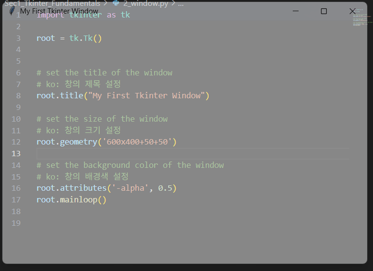

[돌아가기](../README.md)
## 2_Window

- 윈도우의 창 크기, 투명도를 조절합니다.
- title name
    - title("타이틀 이름")
- 크기 조절
    - geometru('width x height + x + y) 형태로 창 크기 설정
    - width와 heigth는 실제 창의 크기
    - x와 y는 주 모니터의 좌측 상단 (0,0) 에서 오른쪽으로 x만큼, 아래로 y만큼 이동한 위치에 창의 왼쪽 위가 위치
    - geometry('600x400+50+50')
- 투명도
    - attributes('-alpha', 0.5)


```py
import tkinter as tk

root = tk.Tk()


# set the title of the window
# ko: 창의 제목 설정
root.title("My First Tkinter Window")

# set the size of the window
# ko: 창의 크기 설정
root.geometry('600x400+500+500')

# 창의 투명도 조절
root.attributes('-alpha', 0.5)
root.mainloop()

```

| 결과


[돌아가기](../README.md)