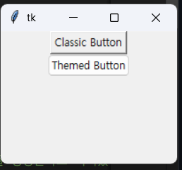

[돌아가기](../README.md)

## 3_tk_themed_widget

```py

# 위젯 테마
# ttk가 테마 버전전
import tkinter as tk
from tkinter import ttk

root = tk.Tk()
root.geometry('600x400+50+50')

# Button은 버튼을 생성한다
tk.Button(root, text='Classic Button').pack()
ttk.Button(root, text='Themed Button').pack()
```
| 결과


### 주요 내장 테마 (OS에 따라 다름)
- default
- classic
- alt
- clam ← 가장 자주 사용됨
- vista (Windows 한정)
- xpnative (Windows 한정)
- aqua (macOS)


### 더 많은 테마
- https://ttkthemes.readthedocs.io/en/latest/

```bash
pip install ttkthemes
```

```py
from tkinter import Tk
from ttkthemes import ThemedTk

root = ThemedTk(theme="arc")  # 예: 'arc', 'breeze', 'plastik' 등
```


## 3_1 tkinter checkbox

```python
import tkinter as tk
from tkinter import ttk
from tkinter import messagebox


root = tk.Tk()
root.geometry('200x150')
root.title('Checkbox Demo')


def show_message():
    messagebox.showinfo(
        title='Result',
        message='You agreed.' if agreement_var.get() else 'You did not agree.'
    )


agreement_var = tk.BooleanVar()

checkbox = ttk.Checkbutton(
    root,
    text='I agree',
    command=show_message,
    variable=agreement_var
)

checkbox.pack()


root.mainloop()
```


[돌아가기](../README.md)