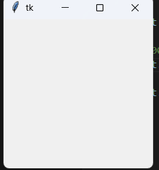
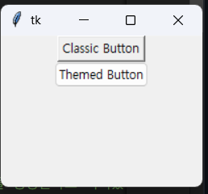

# s1
## 창만들기 (Tkinter Hello, World!)
[1_Tkinter Hello, World!](../Sec1_Tkinter_Fundamentals/1_Tkinter_Hello_World.py)


`tkinter`를 import한 뒤 `root`변수에 `Tk()`로 할당하여 사용함.

`mainloop()`를 사용하여야 메인 창이 화면에 표시됨. 그렇지 않으면 창은 즉시 사라지며, 사용자는 인식 불가능함

보통 마지막 명령문으로 `mainloop`를 배치합니다.

> 관례적으로 기본창의 변수명은 `root`로 합니다. 
> `window`도 사용하기도 하며 다른 이름을 지정하여 사용할 수 있다.


> [!error] ImportError: No module named Tkinter
> 우분투에서 위와 같은 에러가 발생할 수 있습니다. 아래를 설치하세요
> `sudo apt-get install python3-tk`

```py
import tkinter as tk

root = tk.Tk()

# 1000ms (1초) 후에 창 닫기 함수 실행
root.after(3000, root.destroy)

root.mainloop()
```
| 결과




## Window

- 윈도우의 창 크기, 투명도를 조절합니다.
- title name
    - title("타이틀 이름")
- 크기 조절
    - geometru('width x height + x + y) 형태로 창 크기 설정
    - width와 heigth는 실제 창의 크기
    - x와 y는 주 모니터의 좌측 상단 (0,0) 에서 오른쪽으로 x만큼, 아래로 y만큼 이동한 위치에 창의 왼쪽 위가 위치
    - geometry('600x400+50+50')
- 투명도
    - attributes('-alpha', 0.5)


```py
import tkinter as tk

root = tk.Tk()


# set the title of the window
# ko: 창의 제목 설정
root.title("My First Tkinter Window")

# set the size of the window
# ko: 창의 크기 설정
root.geometry('600x400+500+500')

# 창의 투명도 조절
root.attributes('-alpha', 0.5)
root.mainloop()

```

| 결과


## tk_themed_widget

```py

# 위젯 테마
# ttk가 테마 버전전
import tkinter as tk
from tkinter import ttk

root = tk.Tk()
root.geometry('600x400+50+50')

# Button은 버튼을 생성한다
tk.Button(root, text='Classic Button').pack()
ttk.Button(root, text='Themed Button').pack()
```
| 결과


### 주요 내장 테마 (OS에 따라 다름)
- default
- classic
- alt
- clam ← 가장 자주 사용됨
- vista (Windows 한정)
- xpnative (Windows 한정)
- aqua (macOS)


### 더 많은 테마
- https://ttkthemes.readthedocs.io/en/latest/

```bash
pip install ttkthemes
```

```py
from tkinter import Tk
from ttkthemes import ThemedTk

root = ThemedTk(theme="arc")  # 예: 'arc', 'breeze', 'plastik' 등
```


## Command_button


```py

# 요약 : 이 튜토리얼에서는 위젯 이벤트와 콜백을 연결하는 Tkinter 명령 바인딩에 대해 알아봅니다.


import tkinter as tk
from tkinter import ttk

root = tk.Tk()


# 먼저 콜백함수 정의!
def button_clicked():
    print('Button clicked')


# 함수 호출은 ()없어야합니다. 인자 호출 불가능능
ttk.Button(root, text='Click Me', command=button_clicked).pack()

# 람다 함수를 사용하여 콜백 함수에 인자를 전달하는 방법을 보여줍니다.
def callback_function(args):print('Callback function called with args:', args)
ttk.Button(root, text='Rock', command=lambda: callback_function('Rock')).pack()

# 설명으로는 lambda는 간단한 함수 정의
# partial같은 경우 복잡한 함수를 미리 정의하여 호출할때 사용한다고 합니다.
# 하지만 위와 같이 람다 함수를 정의하고 전달한다면 별로 차이가 없어보이는데
# 어떤 기준으로 나눠쓰는지는 모르겠네요, gpt설명으론 재사용이 불가능한다는데 람다 함수를 쓰면 재사용이 가능하다고 하네요;
ttk.Button(root, text='lambda_1', command=lambda: print('lambda_1')).pack()
ttk.Button(root, text='lambda_2', command=partial(print, 'lambda_2')).pack()


def on_button_click(text):
    print('Button clicked with no args : ', text)
ttk.Button(root, text='lambda_3', command=partial(on_button_click, 'lambda_3')).pack()

# ttk.Button(root, text='lambda_4', cogmmand=on_button_click('lambda_4')).pack()
           
root.mainloop()
```

lambda와 partial의 차이(ai)
`lambda`와 `partial`의 차이는 다음과 같습니다.

| 구분     | lambda                  | partial               |
| ------ | ----------------------- | --------------------- |
| 정의 방식  | 익명 함수로 직접 인자 전달         | 기존 함수에 인자를 미리 바인딩     |
| 문법     | `lambda: func(args)`    | `partial(func, args)` |
| 가독성    | 간단한 경우 직관적, 복잡하면 가독성 저하 | 함수 바인딩을 명확하게 표현       |
| 재사용성   | 익명 함수라 재사용 불가           | 생성된 함수 객체는 재사용 가능     |
| 기능 확장성 | 여러 동작 작성 가능             | 함수 + 인자 고정 용도         |

### 요약

* **간단한 콜백**: `lambda`가 직관적이고 간단함
* **인자가 고정된 여러 콜백 반복 사용**: `partial`이 더 깔끔하고 재사용 가능

> 위와 같이 gpt는 답변하지만 실제로 람다 함수를 이용하면 재사용은 가능합니다.


